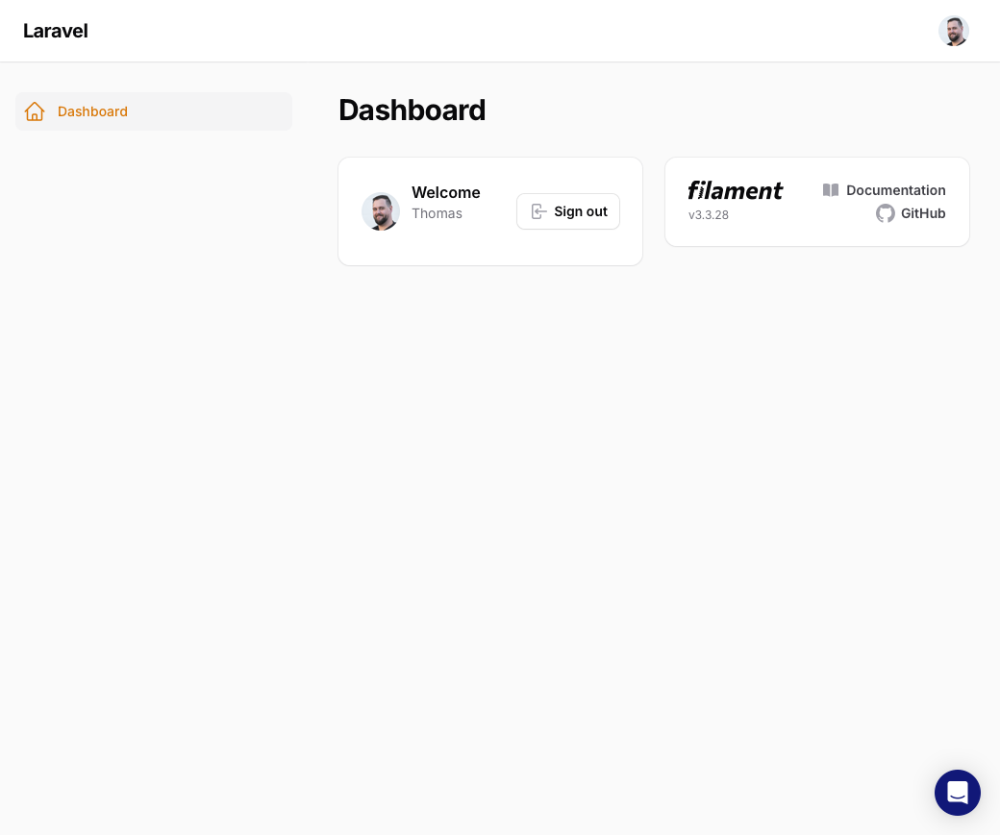

## 🛠 Installation and Setup

You can install this plugin via Composer.

### Step 1: Install the Plugin

Run the following command to install the package via Composer:

```bash
composer require apility/filament-intercom
```

### Step 2: Add this into your Filament PanelProvider class panel()

```php
use Apility\FilamentIntercom\FilamentIntercomPlugin;
 
$panel->...
    ->plugins([
      ...
      FilamentIntercomPlugin::make()      //required to enable this extension
    ]);
```

### Step 3: Add the folloing to your `config/services.php` file

```php
'intercom' => [
    'app_id' => env('INTERCOM_APP_ID'),
],
```

### Step 4: Add your Intercom App ID to your `.env`

```ini
INTERCOM_APPID=<your app id>
```

## Usage

Once installed and registered, the Intercom Chat widget will appear when logged in to the Filament panel



## Advanced

If you need to customize the parameters from the authenticated user thats sent to Intercom, simply implement the `Apility\FilamentIntercom\Contracts\IntercomUser` interface to your User model. This data will be merged with the default values (id, email, name, created_at).

```php
namespace App\Models;

// use Illuminate\Contracts\Auth\MustVerifyEmail;
use Illuminate\Database\Eloquent\Factories\HasFactory;
use Illuminate\Foundation\Auth\User as Authenticatable;
use Illuminate\Notifications\Notifiable;
use Apility\FilamentIntercom\Contracts\IntercomUser;

class User extends Authenticatable implements IntercomUser
{
    ...

    public function getIntercomUserData(): array {
        return [
            'company' => [
                'id' => $this->company->id,
                'name' => $this->company->name,
            ],
        ];
    }
}

```